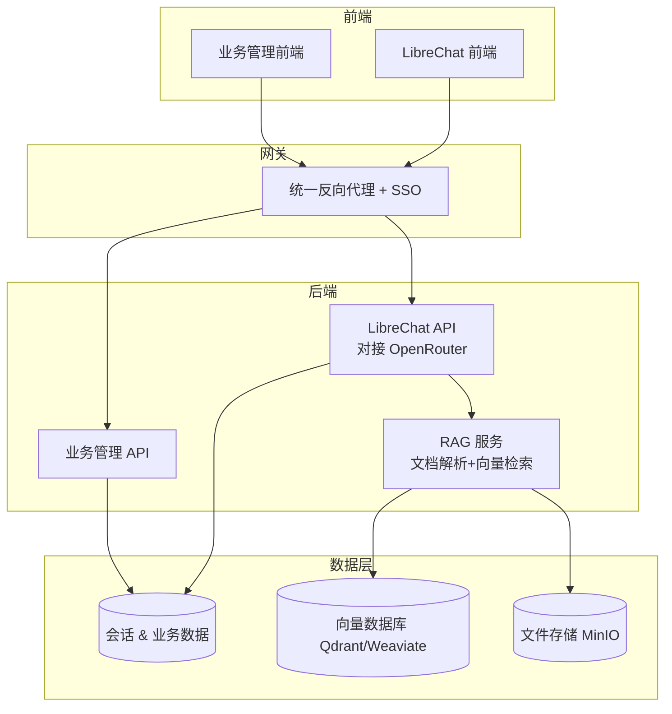

## 🏗️ 总体架构方案



---

## 1️⃣ 聊天系统（LibreChat 替代）

- **推荐项目**：[LibreChat](https://github.com/danny-avila/LibreChat)  
  - 多模型支持（通过OpenRouter访问OpenAI、Claude、Gemini 等）  
  - 多用户、权限管理  
  - 文件上传、联网搜索、插件系统  
  - 完全开源，Docker 一键部署  
- **改造点**：
  - 在 `librechat.yaml` 中配置 OpenRouter API 作为唯一模型端点  
  - 通过OpenRouter访问各种AI模型，统一管理  

---

## 2️⃣ RAG 检索增强生成

- **推荐项目**：[RAGFlow](https://juejin.cn/post/7505779445468774434) 或 [Haystack](https://juejin.cn/post/7505779445468774434)  
  - 支持 PDF/Word/网页等多格式解析  
  - 混合检索（BM25 + 向量检索）  
  - 可与 LibreChat 集成，实现“带知识库的聊天”  
- **部署建议**：
  - 向量数据库用 **Qdrant**（轻量高性能）  
  - 文档存储用 **MinIO**（S3 兼容）  
  - 暴露 REST API 给 LibreChat 调用  

---

## 3️⃣ 业务管理模块（基于之前的需求说明）

- **推荐项目**：  
  - **ERPNext**（全功能 ERP/CRM/项目/财务）  
  - 或 **REBUILD**（零代码企业管理平台，易定制）  
- **集成方式**：
  - 与 LibreChat 共用 SSO（单点登录）  
  - 在业务管理界面内嵌 AI 助手（调用 LibreChat API）  
  - 业务数据可作为 RAG 知识源，供 AI 分析  

---

## 4️⃣ OpenRouter API 接入

- 在 LibreChat 配置文件中添加：
```yaml
endpoints:
  - name: openrouter
    type: openai
    base_url: https://openrouter.ai/api/v1
    api_key: ${OPENROUTER_API_KEY}
```
- RAG 服务调用 LLM 时，也统一走 OpenRouter API  
- 好处：统一计费、统一模型管理、可随时切换模型  

---

## 📦 推荐目录结构

```
myai-suite/
├── librechat/         # 聊天系统
├── rag-service/       # RAG 检索服务
├── erp/               # 业务管理系统
├── gateway/           # Nginx + SSO
├── docker-compose.yml # 一键启动
└── .env               # API Key、数据库配置
```

---

## 🚀 部署建议

- **方式**：Docker Compose（单机）或 Kubernetes（生产）  
- **数据库**：
  - MongoDB：LibreChat 会话 & 业务数据  
  - Qdrant：RAG 向量存储  
- **存储**：
  - MinIO：文档、合同、附件  
- **安全**：
  - 全站 HTTPS  
  - API Key 管理  
  - RBAC 权限控制  

---

