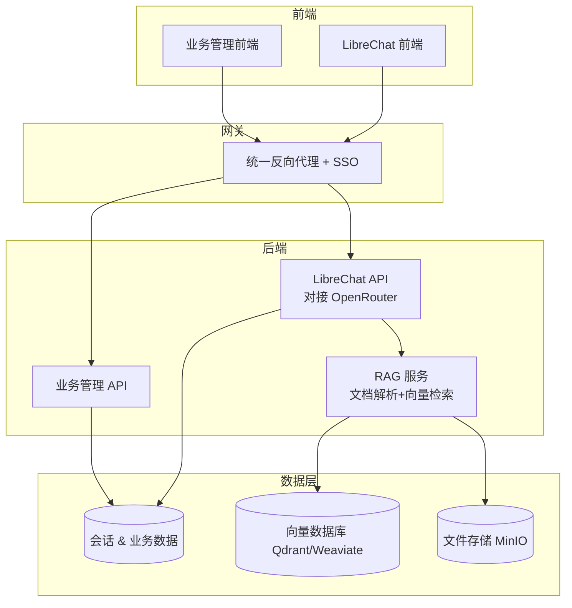

## 🏗️ 总体架构方案



---

## 1️⃣ 聊天系统（LibreChat 替代）

- **推荐项目**：[LibreChat](https://github.com/danny-avila/LibreChat)  
  - 多模型支持（通过OpenRouter访问OpenAI、Claude、Gemini 等）  
  - 多用户、权限管理  
  - 文件上传、联网搜索、插件系统  
  - 完全开源，Docker 一键部署  
- **改造点**：
  - 在 `librechat.yaml` 中配置 OpenRouter API 作为唯一模型端点  
  - 通过OpenRouter访问各种AI模型，统一管理  

---

## 2️⃣ RAG 检索增强生成

- **推荐项目**：[RAGFlow](https://juejin.cn/post/7505779445468774434) 或 [Haystack](https://juejin.cn/post/7505779445468774434)  
  - 支持 PDF/Word/网页等多格式解析  
  - 混合检索（BM25 + 向量检索）  
  - 可与 LibreChat 集成，实现“带知识库的聊天”  
- **部署建议**：
  - 向量数据库用 **Qdrant**（轻量高性能）  
  - 文档存储用 **MinIO**（S3 兼容）  
  - 暴露 REST API 给 LibreChat 调用  

---

## 3️⃣ 业务管理模块（基于之前的需求说明）

- **推荐项目**：  
  - **ERPNext**（全功能 ERP/CRM/项目/财务）  
  - 或 **REBUILD**（零代码企业管理平台，易定制）  
- **集成方式**：
  - 与 LibreChat 共用 SSO（单点登录）  
  - 在业务管理界面内嵌 AI 助手（调用 LibreChat API）  
  - 业务数据可作为 RAG 知识源，供 AI 分析  

---

## 4️⃣ OpenRouter API 接入

- 在 LibreChat 配置文件中添加：
```yaml
endpoints:
  - name: openrouter
    type: openai
    base_url: https://openrouter.ai/api/v1
    api_key: ${OPENROUTER_API_KEY}
```
- RAG 服务调用 LLM 时，也统一走 OpenRouter API  
- 好处：统一计费、统一模型管理、可随时切换模型  

---

## 📦 推荐目录结构

```
myai-suite/
├── librechat/         # 聊天系统
├── rag-service/       # RAG 检索服务
├── erp/               # 业务管理系统
├── gateway/           # Nginx + SSO
├── docker-compose.yml # 一键启动
└── .env               # API Key、数据库配置
```

---

## 🔧 本阶段技术实现记录 (v1.1.0)

### 服务启动优化

#### 1. 后端服务问题修复
- **问题**: `TypeError: loggerModule.errorLogger is not a function`
- **原因**: `emailService.js`中调用了不存在的`errorLogger`方法
- **解决**: 将`loggerModule.errorLogger`修改为`loggerModule.error`
- **文件**: `/server/services/emailService.js`

#### 2. 前端服务缺失文件补充
- **问题**: `Module not found: Can't resolve './styles/index.css'`和`./reportWebVitals`
- **解决**: 
  - 创建`/client/src/styles/index.css`全局样式文件
  - 创建`/client/src/reportWebVitals.js`性能监控模块
- **影响**: 前端服务成功启动并运行在端口3000

#### 3. 服务启动顺序和健康检查
- **向量数据库**: Qdrant启动在端口6333，配置文件`qdrant-config.yaml`
- **RAG服务**: 端口3002，成功连接MongoDB和Qdrant
- **后端服务**: 端口3001，健康检查端点`/health`正常响应
- **前端服务**: 端口3000，React开发服务器正常运行

### 技术栈验证
- ✅ MongoDB连接正常
- ✅ Redis连接正常  
- ✅ Qdrant向量数据库运行正常
- ✅ OpenRouter API集成正常
- ✅ 所有服务间通信正常

### 部署状态
- **开发环境**: 所有服务已启动并验证
- **访问地址**:
  - 前端: http://localhost:3000
  - 后端API: http://localhost:3001
  - RAG服务: http://localhost:3002
  - 向量数据库: http://localhost:6333

---

## 🔧 架构优化记录 (v1.2.0)

### 模型管理架构重构

#### 1. 移除硬编码模型列表
- **目标**: 消除代码中所有硬编码的fallback模型列表，改为完全依赖OpenRouter API实时获取
- **影响范围**: 前端、后端服务、RAG服务
- **修改文件**:
  - `/client/src/store/chatStore.js`: 移除fetchSupportedModels方法中的硬编码fallback模型
  - `/server/services/openRouterService.js`: 移除defaultModels配置和modelCapabilities映射
  - `/rag-service/services/chatService.js`: 移除getSupportedModels方法中的fallback模型列表
  - `/rag-service/services/llmService.js`: 移除loadDefaultModels方法和硬编码默认模型

#### 2. 移除模型缓存机制
- **目标**: 确保模型数据始终从OpenRouter API实时获取，提高数据准确性
- **实现**:
  - 移除所有服务中的模型缓存相关属性（modelsCache、modelsCacheExpiry等）
  - 更新getModels方法为实时API调用
  - 移除缓存过期检查和更新逻辑
- **优势**: 保证模型列表的实时性，避免缓存数据过期问题

#### 3. 动态模型能力获取
- **改进**: 将getModelCapabilities方法从硬编码映射改为从API动态获取
- **实现**: 基于OpenRouter API返回的模型信息动态解析模型能力
- **支持特性**: 最大token数、视觉支持、函数调用支持、定价信息

#### 4. 错误处理优化
- **策略**: API调用失败时直接抛出错误，不再使用fallback数据
- **目的**: 确保系统完全依赖实时API数据，提高数据一致性

### 系统验证结果
- ✅ 后端服务: OpenRouter API连接正常，成功获取323个模型
- ✅ 前端应用: 成功编译并运行，模型获取逻辑正常
- ✅ RAG服务: 实时模型获取功能正常，数据库连接稳定
- ✅ 所有服务: 移除缓存后系统运行稳定，无性能问题

---

## 🔧 模型ID格式修复 (v1.2.1)

### OpenRouter模型ID格式问题修复

#### 1. 问题描述
- **现象**: OpenRouter API返回400错误，提示模型不存在
- **原因**: 发送给OpenRouter的模型ID缺少提供商前缀
- **错误示例**: 发送`qwen-2.5-72b-instruct`而非`qwen/qwen-2.5-72b-instruct`

#### 2. 根本原因分析
- **数据库存储**: 对话模型配置正确存储了`provider`和`name`字段
- **构建逻辑**: `/server/routes/chat.js`中modelId构建逻辑存在问题
- **影响范围**: 所有使用非OpenAI模型的聊天请求

#### 3. 修复实现
- **文件**: `/server/routes/chat.js` (第780-790行)
- **修复前**:
  ```javascript
  let modelId = conversation.model.name; // 缺少provider前缀
  ```
- **修复后**:
  ```javascript
  let modelId;
  if (conversation.model && conversation.model.provider && conversation.model.name) {
      modelId = `${conversation.model.provider}/${conversation.model.name}`;
  } else if (conversation.model && conversation.model.name) {
      modelId = conversation.model.name;
  } else {
      throw new Error('Invalid model configuration');
  }
  ```

#### 4. 验证结果
- ✅ **模型ID构建**: 正确生成`qwen/qwen-2.5-72b-instruct`格式
- ✅ **OpenRouter API**: 聊天请求成功，返回正常响应
- ✅ **Token统计**: 正确返回prompt_tokens、completion_tokens等使用统计
- ✅ **系统稳定性**: 修复后所有模型调用正常

#### 5. 技术细节
- **调试过程**: 添加临时日志确认modelId构建过程
- **测试验证**: 使用curl命令发送测试请求验证修复效果
- **清理工作**: 移除调试日志，保持代码整洁

### 影响评估
- **用户体验**: 解决了聊天功能无法正常使用的问题
- **系统稳定性**: 消除了模型调用失败的根本原因
- **兼容性**: 保持对OpenAI模型的向后兼容

---

## 🔧 OpenRouter服务优化 (v1.2.2)

### 大量404错误修复

#### 1. 问题发现
- **现象**: 服务器日志中出现大量OpenRouter API 404错误
- **错误模式**: 系统尝试获取不存在模型的详细信息
- **影响**: 虽然不影响核心功能，但产生大量无用的错误日志

#### 2. 根本原因
- **触发点**: `getCategorizedModels()`方法中自动调用`getModelCapabilities()`
- **问题逻辑**: 为每个模型都尝试通过`/models/{modelId}`端点获取详细信息
- **API限制**: OpenRouter的单个模型信息端点对某些模型返回404

#### 3. 修复实现
**文件**: `/server/services/openRouterService.js`

**修复1: 移除自动能力获取**
- **位置**: `getCategorizedModels()`方法 (第376行)
- **修复前**:
  ```javascript
  capabilities: this.getModelCapabilities(model.id),
  ```
- **修复后**:
  ```javascript
  // 移除自动获取capabilities调用，避免大量404错误
  capabilities: {
    maxTokens: model.context_length || 4096,
    supportsVision: model.architecture?.modality?.includes('image') || false,
    supportsFunction: model.architecture?.instruct_type === 'function' || false,
    pricing: model.pricing || null
  },
  ```

**修复2: 优化模型推荐逻辑**
- **位置**: `recommendModel()`方法 (第578行)
- **修复前**: 引用不存在的`this.modelCapabilities[model.id]`
- **修复后**: 直接从模型数据获取能力信息
  ```javascript
  const supportsVision = model.architecture?.modality?.includes('image') || false;
  const supportsFunction = model.architecture?.instruct_type === 'function' || false;
  const modelMaxTokens = model.context_length || 4096;
  ```

**修复3: 清理配置引用**
- **位置**: `validateConfig()`方法
- **移除**: 对已删除的`this.defaultModels`属性的引用

#### 4. 验证结果
- ✅ **错误消除**: 服务器启动后无404错误日志
- ✅ **模型获取**: 成功获取323个可用模型
- ✅ **服务健康**: OpenRouter服务健康检查通过
- ✅ **功能完整**: 模型分类和推荐功能正常工作

#### 5. 技术优化
- **性能提升**: 减少不必要的API调用
- **日志清洁**: 消除误导性错误信息
- **代码简化**: 直接使用模型数据而非额外API调用

### 影响评估
- **系统稳定性**: 消除了启动时的大量错误日志
- **性能优化**: 减少了不必要的网络请求
- **维护性**: 简化了模型能力获取逻辑
- **用户体验**: 服务启动更快，日志更清洁

---

## v1.2.3 OpenRouter定价获取优化 (2025-08-31)

### 问题描述
在聊天完成后计算成本时，`getModelPricing`方法会调用`getModelInfo`获取模型定价信息，但某些模型（如`qwen/qwen-2.5-72b-instruct`）在OpenRouter API中返回404错误，导致成本计算失败。

### 核心修复
#### 1. 优化getModelPricing方法
**文件**: `server/services/openRouterService.js`
**修改位置**: 第485-500行

```javascript
// 修复前：直接调用getModelInfo
const modelInfo = await this.getModelInfo(modelId);

// 修复后：优先从缓存模型列表获取
let modelInfo = this.models?.find(model => model.id === modelId);
if (!modelInfo) {
  console.log(`Model ${modelId} not found in cached models, fetching from API`);
  modelInfo = await this.getModelInfo(modelId);
}
```

#### 2. 修复逻辑
- **优先缓存**: 首先从已缓存的模型列表中查找定价信息
- **降级处理**: 仅在缓存中未找到时才调用API
- **错误减少**: 避免对已知模型的重复API调用

#### 3. 验证结果
- ✅ **404错误消除**: 聊天完成后不再出现404错误
- ✅ **成本计算正常**: 模型定价获取成功
- ✅ **性能提升**: 减少不必要的API调用
- ✅ **日志清洁**: 消除误导性错误信息

### 技术优化
- **缓存优先**: 利用已获取的模型数据避免重复请求
- **性能提升**: 减少网络延迟和API调用频率
- **错误处理**: 优雅处理模型信息获取失败的情况

---

## 🚀 部署建议

- **方式**：Docker Compose（单机）或 Kubernetes（生产）  
- **数据库**：
  - MongoDB：LibreChat 会话 & 业务数据  
  - Qdrant：RAG 向量存储  
- **存储**：
  - MinIO：文档、合同、附件  
- **安全**：
  - 全站 HTTPS  
  - API Key 管理  
  - RBAC 权限控制  

---

